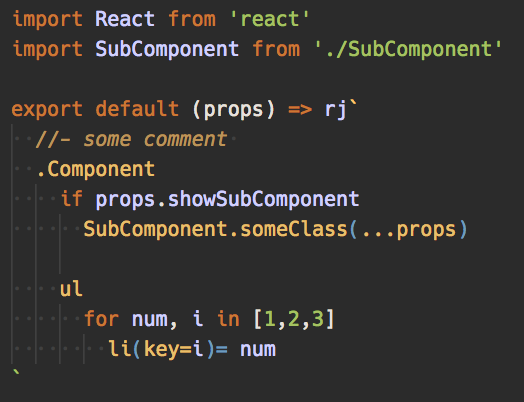

> forked from [kaminaly/vscode-react-pug](https://github.com/kaminaly/vscode-react-pug).
> Thanks to [kaminaly](https://github.com/kaminaly)!

# vscode-react-jade
Syntax highlighting for jade with react [(react-jade-transformer)](https://github.com/weareoffsider/react-jade-transformer) in JavaScript and TypeScript.



jade would be written written inside `rj` or `jade` tagged with backticks.
for example.

```
rj`
    .Component
`

jade`
    .Component
`
```

## Install
Inside VSCode, press `Ctrl+P`, and enter:

```
ext install vscode-react-jade
```

[[Source](https://marketplace.visualstudio.com/items?itemName=yamadashy.vscode-react-jade)]!
